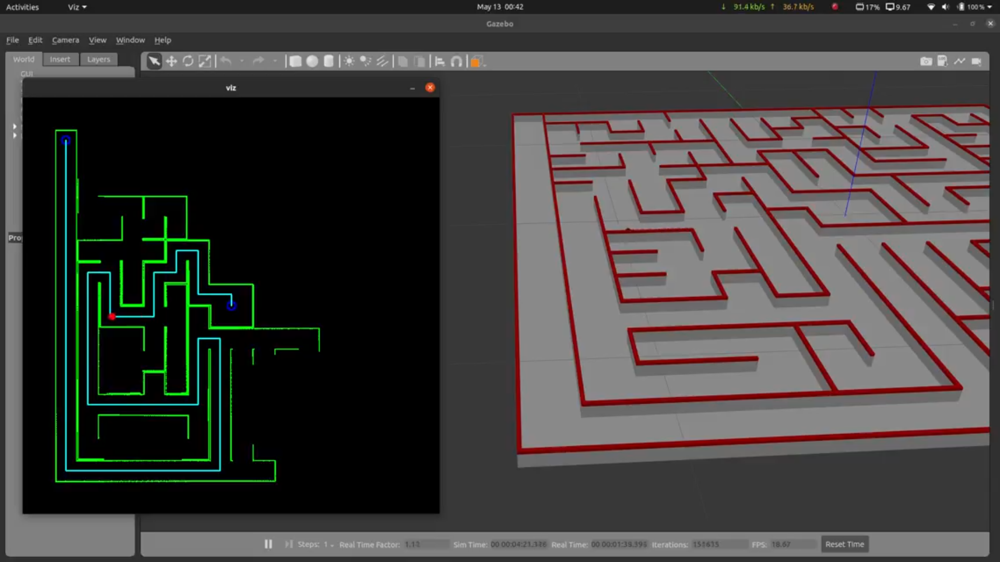

# Techfest-Micromouse
This repository contains the package **pkg_tf_micromouse**. It uses ROS melodic and gazebo classic 9.

submitted by: Team : MC-213436

Uploaded video of submission : [here](https://www.youtube.com/watch?v=is9BNbxqwGE)

Video with vizualization: [mmc.mp4](./data/mmc.mp4)

Award: 2nd runners up, Techfest 2021

### steps for running simulation

1. Start the container:  `docker compose up --build` 
2. Open a terminal in the container: `docker exec -it mmc_container bash`
3. Launch the simulation in a world of your choice using `roslaunch pkg_tf_micromouse final.launch world_name:=<name>`. 

    Available worlds are `arena.world` and `arenax.world` where x can be 1,2,3,4,5.
4. The mouse will make a searching run followed by a final run.
5. shut the container with `docker compose down`.

I lost the vizualizer code unfortunately. So the current repo contains the non-vizualized simulation.

